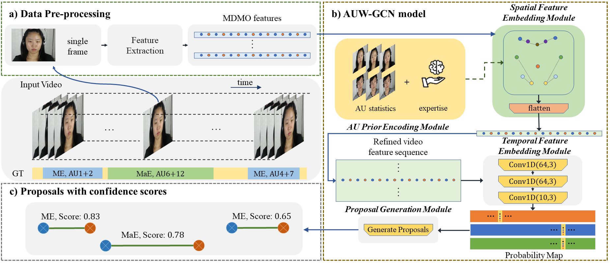

# AUW-GCN-for-ME-Spotting
PyTorch implementation for the paper "AU-AWARE GRAPH CONVOLUTIONAL NETWORK FOR MACRO- AND MICRO-EXPRESSION SPOTTING" (**ICME 2023**, 
long paper): [IEEE version (Coming soon)](),  [arXiv version]().



> The codes are modified from [USTC_ME_Spotting
](https://github.com/wenhaocold/USTC_ME_Spotting).


## Prerequisites
- python 3.x with pytorch, numpy, tensorboard, tqdm, yaml
- cuda, cudnn

## Getting started
1. Clone this repository
```shell
$ git clone git@github.com:xjtupanda/AUW-GCN.git
$ cd AUW-GCN
```

2. Download features

For the features of SAMM-LV and CAS(ME)^2 datasets, please download [features.tar.gz](
https://pan.baidu.com/s/1Pj_CnnypSfNOTaSO1BFKdg?pwd=mpie) 
(Modified from 
[USTC_ME_Spotting#features-and-config-file](https://github.com/wenhaocold/USTC_ME_Spotting#features-and-config-file)) and extract it:
```shell
$ tar -xf features.tar.gz -C dir_to_save_feature
```
After downloading the feature files, the variables of feature path, `segment_feat_root`, in [config.yaml](https://github.com/xjtupanda/AUW-GCN/blob/main/config.yaml) should be modified accordingly.

3. Training and Inference

Set `SUB_LIST`, 
`OUTPUT` (dir for saving ckpts, log and results)
and `DATASET` ( ["samm" | "cas(me)^2"] )  in [pipeline.sh](https://github.com/xjtupanda/AUW-GCN/blob/main/pipeline.sh), then run:
```shell
$ bash pipeline.sh
```


## Citation
If you feel this project helpful to your research, please cite our work.
```

```

##### Please email me at xjtupanda@mail.ustc.edu.cn if you have any inquiries or issues.
